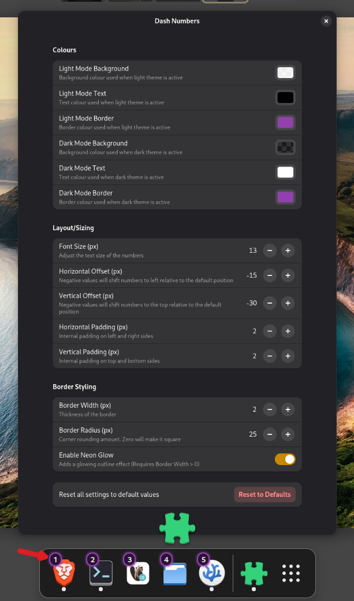
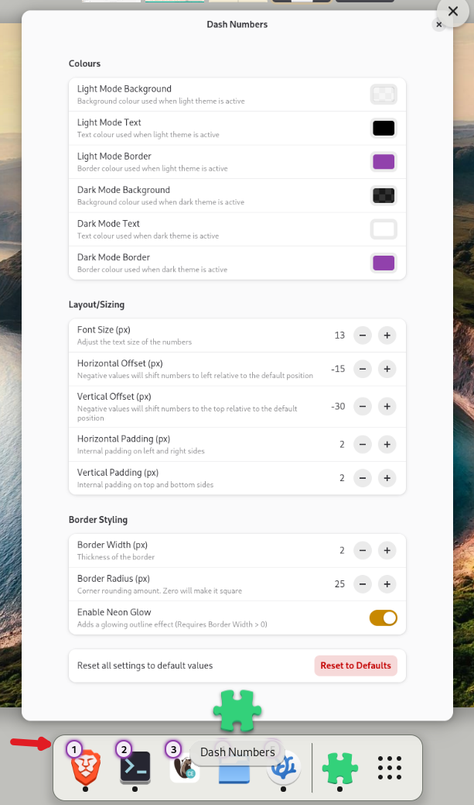

# Dash Numbers

A lightweight GNOME Shell extension that adds number badges (1–9) to pinned applications on the native GNOME Dash.

GNOME Shell natively supports launching and switching to pinned apps using Super + 1 through Super + 9. However, visually identifying which app corresponds to which number requires counting down your dock manually. Dash Numbers removes this ambiguity by displaying clear, subtle number overlays on your pinned icons.

## Features & Customization

**Colors (Light & Dark Mode):** Set background color, text color, and border color based on your system theme.

**Shape & Geometry:** you can chnge the border radius and width to transform badges into sharp squares, continuous squircles, or perfect circles.

**Size & Spacing:** Adjust font size alongside horizontal and vertical padding.

**Positioning**: Shift badges horizontally and vertically to position them exactly where you want relative to each dock icon.

**Neon Border Glow:** Enable a subtle outer glow on badge borders to give your dock a high-contrast or futuristic accent.




## Installation

The easiest way to install this extension is from [extensions.gnome.org](https://extensions.gnome.org/) once published. But if you wish to install from source

1. clone the repo

```sh
git clone https://github.com/ags1773/gnome-dash-numbers.git

cd gnome-dash-numbers
```

2. Build the extension

```sh
gnome-extensions pack --extra-source=schemas --force
```

3. Install the generated package

```sh
gnome-extensions install --force dash-numbers@ags1773.github.io.shell-extension.zip
```

4. Enable the extension
   Log out and log back in (wayland) and enable the extension
